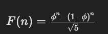

# desafio_tecnico
## 1.1
Primeiramente:
git pull origin main

git checkout main

git merge feat/calculate-total-add-discount

Nesse momento será dado a mensagem de erro de conflito

particularmente, como uso visual code aparece uma opção para que possa resolver no conflict editor
então uso essa ferramenta, com isso consigo observar o que deve ser mudado e deixo a tarefa que meu companheiro estava fazendo, e completo a minha

git commit -m "merge foi feito"

git push

git checkout feat/calculate-total-add-discount

git merge main

git commit -m "merge feito com a main"

git push

## 1.2
chmod +x logging.sh

para somente executar e colocar em um arquivo de saída
./logging.sh > output.log 2>&1

para separar:
./logging.sh > stdout.log 2> stderr.log

## 1.3

O codigo 1.3 irá matar todos os processos.

chmod +x kill_process.sh


./kill_process.sh binary_name

## 2.1
## 2.1.1
O fibonacci é bem conhecido fácil de fazer por isso a explicação do código "fibonacci.py" será trivial.
O fibonacci com custo O(1) em memória é valido explicar. No código "fibonacciO1.py" as variáveis serão redeclaradas a cada loop sendo elas sempre vet[i-1] e vet[i-2].

## 2.1.2

O problema de fibonacci no custo O(1) em tempo tem a necessidade do uso da formula de Binet que aproxima o número de fibonacci, conseguindo chegar ao N-esímo número.

O problema de fibonacci aproximado deve ser feito de forma que haja um vetor pré-computado salvo e pronto para ser acessado, então assim será somente o custo de acesso.

## 2.2
Não, essa não é a melhor forma de implementar essa função, a complexidade de tempo dela é O(n^2).
Para ter a melhor forma seria necessário percorrer a string 1 vez salvando todas as letras e primeiras ocorrências e fazendo a contagem.
No meu método a cada vez que é visto uma letra é retirada todas as ocorrências e todas são deletadas da string, e essas informações são salvas em um array.
A cada vez que é percorrida a string diminui, porém não deixa de ser um O(n^2).

## 3.1
Os hooks devem sempre estar acima da lógica condicional, eles não devem ser chamados em loops ou em condicionais

deve-se passar o if para cima da declaração do useState, e o problema estará resolvido

Os hooks devem ser chamados na mesma ordem para que o react consiga associar de forma correta todos os estados e efeitos. Caso a ordem mude podem ser gerados bugs.
Isso também facilita o debug

```import React, { useState } from 'react';

interface Item {
  name: string;
  description: string;
}

interface ItemsCardProps {
  items: Item[];
}
const ItemsCard: React.FC<ItemsCardProps> = ({ items }) => {
  const [currentIndex, setCurrentIndex] = useState(0);
  if (items.length === 0) {
    return <div>No items!</div>;
  }

  const item = items[currentIndex];

  const handleChangeItem = () => {
    setCurrentIndex(i => (i + 1) % items.length);
  };

  return (
    <div>
      <h3>Item #{currentIndex + 1} - {item.name}</h3>
      <span>{item.description}</span>
      <button onClick={handleChangeItem}>Next</button>
    </div>
  );
}
export default ItemsCard```


## 3.2

O detalhe que está faltando no código é a key única para cada item da lista
Para resolver:
COlocar o campo id na interface item e usar o id como key para mapear a lista

```import React from 'react';

interface Item {
  id: number;
  name: string;
  description: string;
}

interface ItemsListProps {
  items: Item[];
}

export default function ItemsList({ items }: ItemsListProps) {
  return (
    <div>
      {items.map(item => (
        <div key={item.id}>
          <h3>{item.name}</h3>
          <span>{item.description}</span>
        </div>
      ))}
    </div>
  );
}```

## 4.1
https://chatgpt.com/share/212034c8-4f9b-4d5c-b43b-111f4c391bcf

Para chegar no prompt final, foram testadas algumas formas de prompt, tentei deixar o mais limitado possível para que somente coletasse informações essenciais para o processo.
Foi testado na IA Gemini, porém não houveram resultados satisfatórios com o que estava sendo pedido.
As respostas da Gemini foram divagadas, e também foi iniciado uma explicação que não foi pedida para a IA.

Voltando para o ChatGPT, foram tentadas alguns outros prompts, mas o que foi mais efetivo foi o que possuía uma estrutura, então sempre que for necessário pedir para IA algo deve-se
fornecer uma estrutura de base.

## 4.3
https://chatgpt.com/share/91d3ed25-cadb-4003-9a03-5138069a3db4

Sobre a IA Gemini, ela pode ser uma boa opção para utilizar de forma mais casual, ela não segue uma estrutura, mesmo que seja pedido no prompt, o prompt usado no ChatGPT resultou em uma resposta muito maior e não tão especifico quanto o esperado.

Sobre o ChatGPT.

Para chegar no prompt final que tem como output boas respostas e simples foram feitos testes, esses testes envolviam tentar fazer um pequeno prompt um pouco mais geral
para assim ver o que faltaria, também é importante ressaltar informações de extrema importância e reafirmar algumas coisas.

Por exemplo, ele usava muitos tópicos, mas tópicos não são bons em certos casos então foi pedido à IA para evitar o uso de tópicos, mesmo assim em algumas perguntas
os tópicos eram utilizados, porém quando foi reafirmado a não utilização dos tópicos eles não foram utilizados.

E com isso o atendimento será feito de forma que o usuário esteja confortável.


